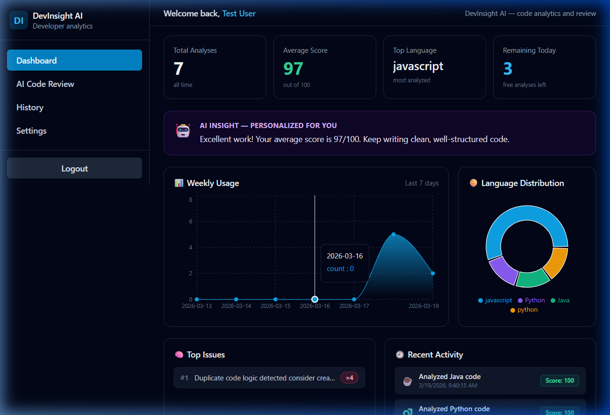
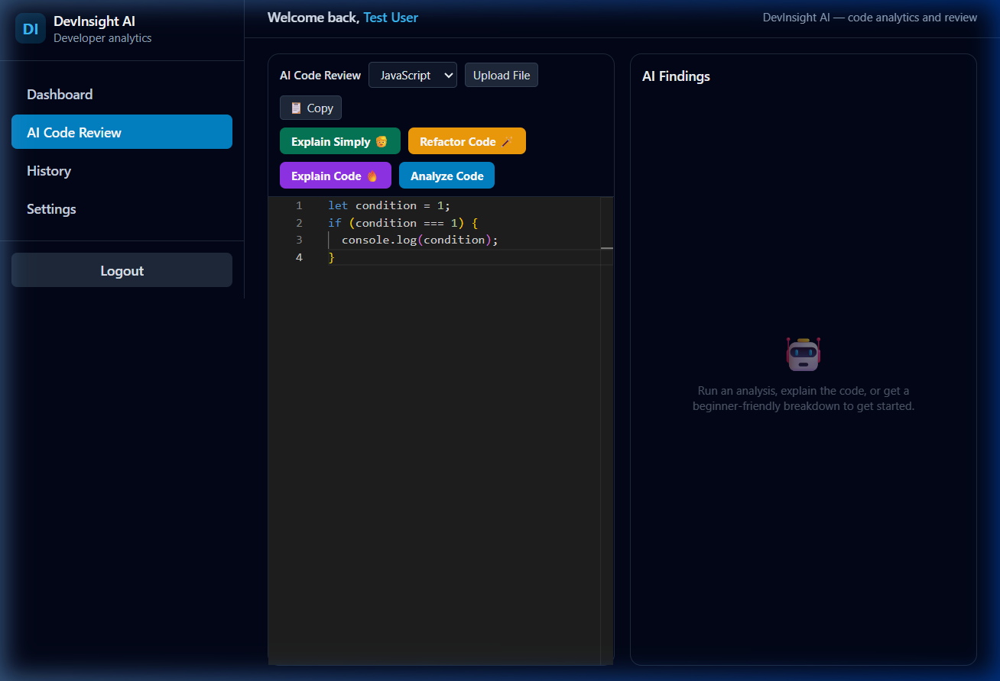
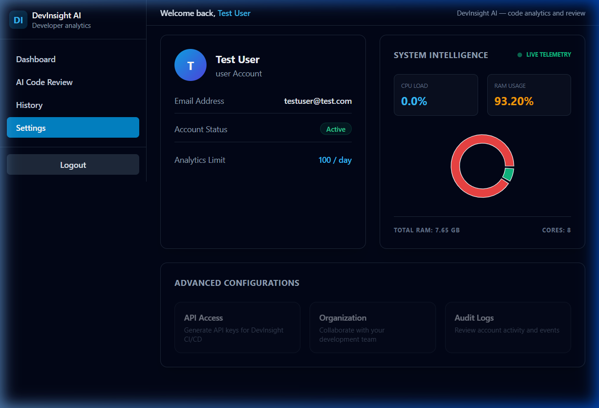
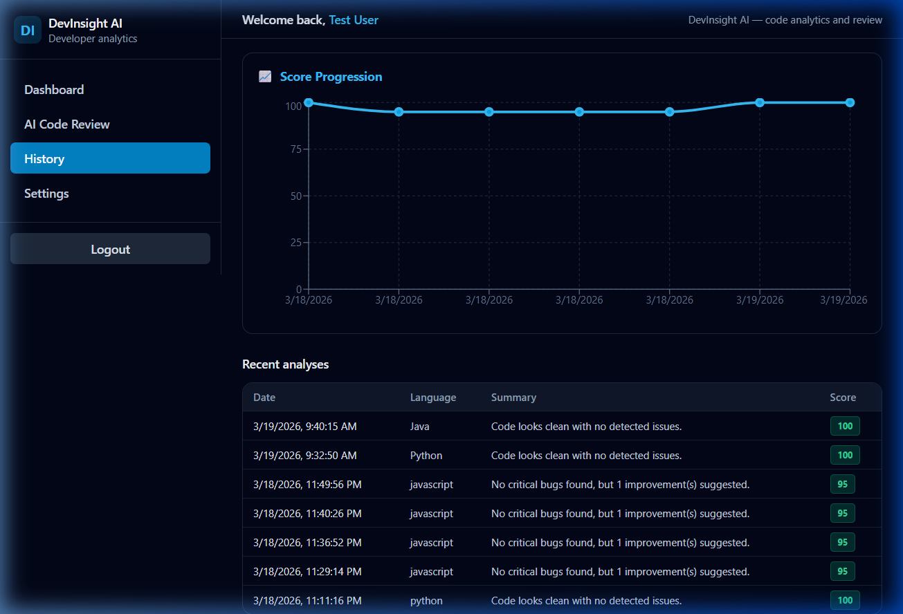

# DevInsight AI — Advanced Code Analysis & Optimization 🚀

DevInsight AI is an industry-grade code analysis platform that leverages advanced AI to provide real-time quality scores, bug detection, and automated refactoring. 

<p align="center">
  
  
</p>

##  Key Features

###  1. Realistic Code Scoring
Unlike other tools that give a perfect score to everything, DevInsight AI uses language-specific analyzers (Python, JavaScript, **Java**) to detect missing error handling, unclosed resources, and poor naming conventions. 

###  2. AI Code Refactor (Auto-Fix)
Don't just find bugs—fix them. Our AI-driven refactoring engine can rewrite suboptimal or broken code into clean, industry-standard logic with a single click.

###  3. System Intelligence & Telemetry
A live dashboard in the settings page provides real-time monitoring of server health, including CPU load and RAM usage, using backend telemetry.

### 4. GitHub Repository Analysis
Analyze any public GitHub repository by simply pasting its URL. The engine identifies the main entry point and provides a comprehensive quality report in seconds.

---

##  Project Gallery

<table align="center">
  <tr>
    <td align="center"><b>Analytics Dashboard</b><br/></td>
    <td align="center"><b>AI Code Refactor</b><br/></td>
  </tr>
  <tr>
    <td align="center"><b>System Telemetry</b><br/></td>
    <td align="center"><b>History Progression</b><br/></td>
  </tr>
</table>

---

##  Tech Stack

- **Frontend**: React (Vite), Tailwind CSS, Monaco Editor, Recharts, jsPDF.
- **Backend**: Node.js, Express, Mongoose.
- **Database**: MongoDB (Atlas).
- **AI Engine**: Google Gemini, Groq (Llama-3), or OpenAI.

---

##  Getting Started

### 1. Prerequisites
- Node.js (v18+)
- MongoDB Atlas connection string

### 2. Installation
```bash
# Clone the repository
git clone https://github.com/DiwakarNallappagari/DevInsight-AI-.git

# Install Backend Dependencies
npm install

# Install Frontend Dependencies
cd client
npm install
```

### 3. Environment Setup
Create a `.env` file in the root directory (use `.env.example` as a template):
```env
PORT=5000
MONGO_URI=your_mongodb_url
GEMINI_API_KEY=your_key
JWT_SECRET=your_secret
```

### 4. Run the App
```bash
# Start Backend (from root)
npm run dev

# Start Frontend (from client)
cd client
npm run dev
```

---

##  Security
All API keys and database credentials are kept private via environment variables. Refer to `.env.example` for the required structure.

---

##  License
MIT License. Created with ❤️ for developers.
